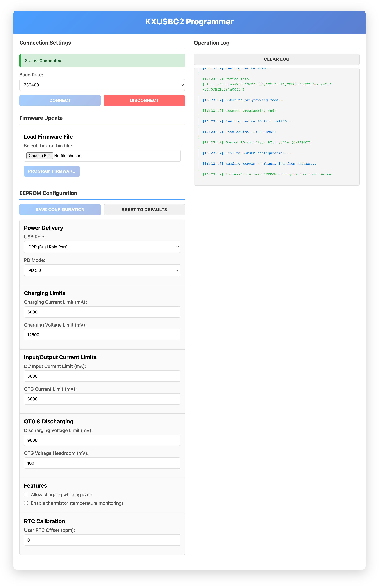

# KXUSBC2 Programmer

This is a browser-based programming tool for the ATtiny3226 microcontroller on the KXUSBC2. It allows updating the firmware, and changing the EEPROM configuration.



Prerequisites:

* KXUSBC2
* Simple "serial UPDI" programmer (see below)
* Browser that supports the Web Serial API (Chrome, Edge, Opera)

You can access this programmer directly in your browser, without downloading or building anything, here:

**https://manuelkasper.github.io/kxusbc2/programmer/**

This programmer is based on the more generic [WebUPDI](https://github.com/manuelkasper/webupdi).

## Simple UPDI programmer hardware

The hardware for a UPDI programmer can be very simple and cheap: a USB-to-Serial adapter with TTL levels (3.3 or 5 V depending on the circuit that the AVR is being used in) and a 1k resistor is all that it takes. See for example here:

* UPDI Friend: https://www.adafruit.com/product/5879
* https://github.com/BlackBrix/AVR-Programmer/tree/master/SerialUPDI_Programmer
* https://github.com/umbertoragone/nanoupdi

## Development

### Setup
```bash
npm install
```

### Development Server
```bash
npm run dev
```
This starts a local development server at http://localhost:3000 with hot module reloading.

### Build for Production
```bash
npm run build
```
This generates an optimized production build in the `dist/` directory that can be deployed to a web server.

### Preview Production Build
```bash
npm run preview
```
This starts a local server to preview the production build.
